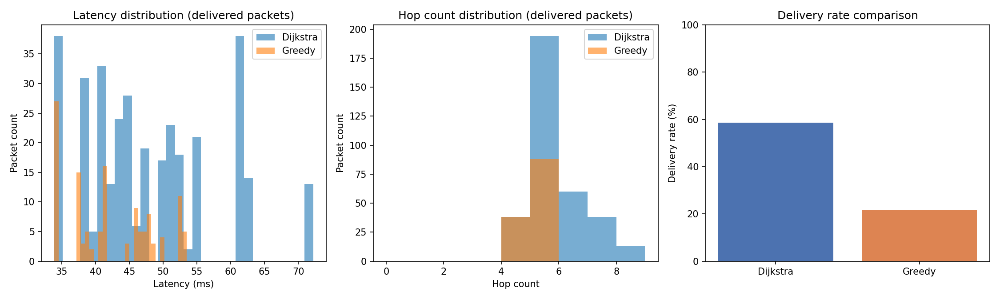

# satsim - LEO Satellite Constellation Network Simulator

A C++ simulator for low-Earth-orbit (LEO) satellite constellations, modeling
both the orbital mechanics (where satellites actually are over time) and
the network layer (how packets route across a topology that's constantly
changing as satellites move in and out of range of each other and the
ground) - similar in spirit to how Starlink or Iridium operate.

## Why this project

Satellite mega-constellations are a genuinely hard networking problem: unlike
a data center, the topology isn't static - links appear and disappear as
satellites orbit, so routing has to adapt continuously. This project builds
that up from first principles: real orbital mechanics, a time-varying network
graph, multiple routing strategies, a full discrete-event simulation with
traffic and link congestion, and a quantified comparison of routing
strategies under identical conditions.

## Status

Phase 6 complete: Metrics and analysis.
See [docs/roadmap.md](docs/roadmap.md) for remaining stretch goals.

## Results

Running identical traffic (585 packets over 5 minutes, same random seed) through
both routing strategies on the same 60-satellite constellation:



| Router | Delivery rate | Average latency |
|---|---|---|
| Dijkstra (global knowledge) | 58.6% | 47.91 ms |
| Greedy geographic (local knowledge only) | 21.5% | 42.26 ms |

This is one of the more interesting findings from the whole project:
Dijkstra delivers nearly 3x more packets than greedy routing under the same
conditions - the cost of only having local knowledge is real and
substantial. Greedy's average latency for the packets it *does* deliver is
slightly lower, because it only ever succeeds on the easier, more direct
routes; the harder routes it can't find at all become drops rather than
detours, and those never show up in a latency figure that only counts
delivered packets. Regenerate this exact result with
`./build/metrics_demo && python3 scripts/plot_results.py`.

## What's implemented so far

**Phase 1 - Orbital mechanics core**
- `Vector3` - 3D vector math (dot/cross product, normalization, angles)
- `JulianDate` - astronomical time system with GMST for ECI/ECEF conversion
- `KeplerianElements` - the six classical orbital elements
- `OrbitPropagator` - two-body Keplerian propagator (Newton-Raphson Kepler
  solver, Cartesian position/velocity, ground tracks)

**Phase 2 - Constellation generation**
- `WalkerConstellation` - generates a full Walker-Delta pattern (the same
  design approach real systems like Starlink, Iridium, and GPS use)
- `GroundStation` - fixed points on Earth's surface, with ECEF and ECI
  positions

**Phase 3 - Dynamic network graph**
- `visibility::hasLineOfSight` / `isVisibleFromGroundStation` - the
  geometry that decides whether two nodes can communicate
- `NetworkGraph` - a full snapshot of the network topology at a given
  instant, with propagation delay computed from distance and the speed of
  light

**Phase 4 - Routing algorithms**
- `Router` - a common interface so routing strategies can be swapped and
  compared on the same topology
- `DijkstraRouter` - global-knowledge shortest-path routing (the optimal
  baseline)
- `GreedyGeographicRouter` - distributed routing using only local neighbor
  knowledge, more realistic for how a real satellite network would operate,
  including its realistic failure mode (getting stuck at a "local minimum")

**Phase 5 - Discrete-event simulation engine**
- `EventQueue` - a time-ordered priority queue of scheduled actions
- `Simulator` - generates packet traffic between random ground station
  pairs (Poisson arrivals), routes each packet, and simulates its journey
  hop by hop with real link congestion (first-come-first-served queuing per
  link)

**Phase 6 - Metrics and analysis**
- `PacketRecord` / `metrics::exportPacketRecordsToCsv` - every packet's
  journey (source, destination, latency, hop count, delivered or dropped)
  exported to CSV, one row per packet, ready for offline analysis
- `scripts/plot_results.py` - reads the CSVs and produces the comparison
  chart above (latency distribution, hop count distribution, delivery rate)

Verified against known physical behavior: a 550 km circular orbit at 53
degree inclination (Starlink-like parameters) produces a ~95.6 minute
period; a generated 60-satellite/12-plane constellation has planes and
satellites evenly spaced exactly as the Walker pattern requires; the
network graph correctly identifies visibility and produces sensible
propagation delays; Dijkstra always finds a path at least as good as greedy
routing whenever greedy succeeds; running identical traffic through a
high-capacity link versus a throttled one shows average latency nearly
doubling purely from queuing congestion; and every packet's CSV row is
internally consistent (delivered packets always have positive latency and
hop count, dropped packets always have zero) - all confirmed by the test
suite (50 tests, ~2,340 assertions).

### A note on orbital plane crossings

Running the network graph demo, you may notice two satellites in different
planes occasionally sitting at (almost) the exact same position. This isn't
a bug: any two orbital planes around a sphere intersect at exactly two
antipodal points (since both are great circles through Earth's center), and
depending on the constellation's phasing factor, two satellites can cross
that intersection point at the same moment. Real constellation designs have
to choose their phasing carefully to manage this - it's a genuine design
consideration, not a simulation artifact.

### A note on coverage gaps

With only 60 satellites (real Starlink shells use thousands), routing
between two ground stations will sometimes fail entirely - at that exact
instant, there may genuinely be no satellite overhead near one of the
stations, so no path exists no matter how good the routing algorithm is.
This is a real, expected limitation of small constellations, and part of
why the delivery rates above are well under 100% even for Dijkstra.

## Building

Requires CMake 3.16+ and a C++17 compiler. The analysis script additionally
requires Python 3 with matplotlib (`pip install matplotlib`).

```bash
cmake -B build
cmake --build build

./build/ground_track_demo    # propagate a satellite and print its ground track
./build/constellation_demo   # generate a 60-satellite Walker constellation + ground stations
./build/network_graph_demo   # build the dynamic network graph and show it changing over time
./build/routing_demo         # compare Dijkstra vs greedy geographic routing
./build/sim_demo             # run the discrete-event simulation, showing congestion's effect on latency
./build/metrics_demo         # run both routers under identical traffic, export CSVs to results/
./build/satsim_tests         # run the unit test suite

python3 scripts/plot_results.py   # after metrics_demo, generate results/comparison.png
```

## Project layout

```
include/orbit/           - Vector3, Time, KeplerianElements, OrbitPropagator
include/constellation/   - WalkerConstellation, GroundStation
include/network/         - Visibility, NetworkGraph
include/routing/         - Router, DijkstraRouter, GreedyGeographicRouter
include/sim/             - EventQueue, Simulator
include/metrics/         - CsvExport
src/                     - Implementation, mirroring the include/ layout
tests/                   - Unit tests (dependency-free custom test framework)
examples/                - Demo programs
scripts/plot_results.py  - Python/matplotlib analysis of exported CSVs
docs/roadmap.md          - Full multi-phase build plan
docs/images/             - Generated charts referenced in this README
```

## Design notes

The propagator currently models unperturbed two-body dynamics - accurate
enough to validate the geometry and network layers, with room to add J2
oblateness perturbation later without changing the public interface (see
roadmap). Kepler's equation is solved with Newton-Raphson rather than a
closed form since no closed-form solution exists for elliptical orbits.

The network graph uses a spherical Earth model for occlusion and elevation
checks - a reasonable approximation at these altitudes.

Routing strategies share a common `Router` interface so new strategies can
be added and benchmarked without touching any calling code.

The simulator rebuilds the network topology on a fixed time interval rather
than computing the exact moment each individual link appears or disappears
- a standard, well understood approximation that's accurate enough here
since typical packet lifetimes (tens of milliseconds) are far shorter than
the rebuild interval (tens of seconds). Each in-flight packet holds a
shared_ptr to the exact network graph snapshot it was routed on, so its
path stays valid for its entire journey even if the simulator rebuilds a
newer topology snapshot in the meantime.

CSV export is deliberately per-packet rather than pre-aggregated, so any
analysis (percentiles, filtering by route, custom charts) can be done
offline without re-running the simulation - the Python script is one
example consumer, not the only possible one.

## License

MIT - see [LICENSE](LICENSE).
